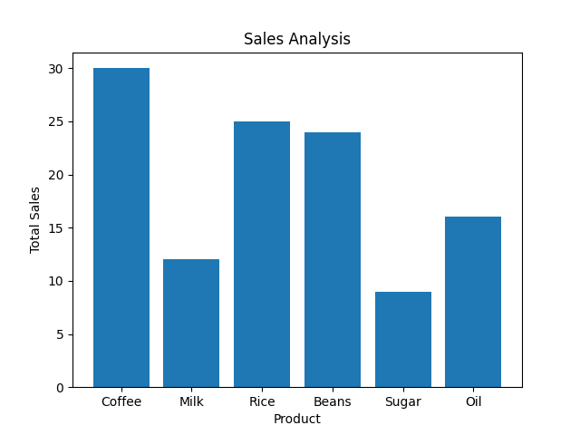

# Sales System Analytics

This project combines a simple sales system with data analysis and automated report generation.

## Features

- Register sales (Python system)
- Analyze sales data (Pandas)
- Generate charts automatically (Matplotlib)

## Technologies

- Python
- SQL
- Pandas
- Matplotlib

- ## Installation

Clone the repository:

git clone https://github.com/Natty-souza/Sales-System-Analytics.git

Install dependencies:

pip install pandas matplotlib

Run the project:

python analytics.py

## Project Structure

- main.py → simple sales system
- analytics.py → data analysis and report generation
- sales_data.csv → sample data
- database.sql → database structure
## Example Output

